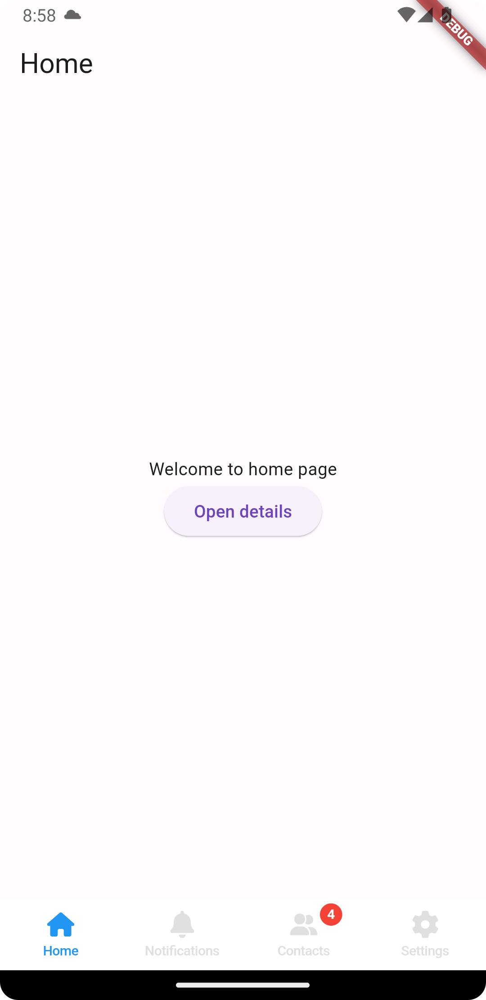
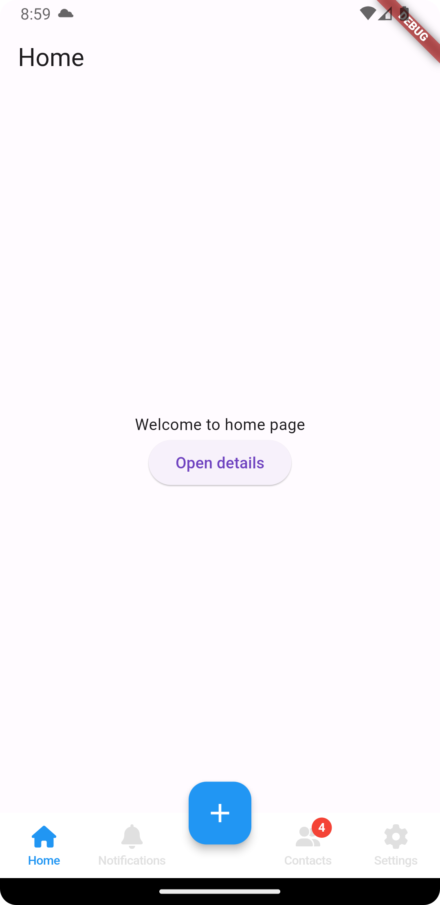
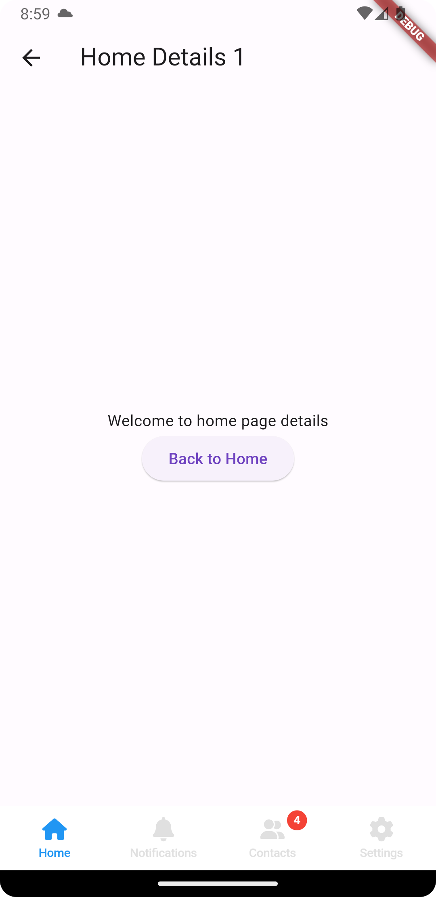

## Overview
The Flutter package `BottomCupertinoTabbar` is designed for creating a customizable and intuitive bottom navigation bar with a Cupertino (iOS-style) aesthetic. It offers separate navigation stacks for each tab, ensuring that the state of each tab is maintained when users switch between them.
The package provides extensive customization options, including the ability to add a floating action button or other widgets in various locations on the tab bar.

---

<p align="center">
  
</p>
<p align="center">
    
    
</p>

<p align="center">
  <a href="https://pub.dev/packages/convex_bottom_bar"></a>
  <a href="https://github.com/hacktons/convex_bottom_bar"></a>
</p>

---


## Table of contents

- [Features](#features)
- [Installation](#installation)
- [Import](#import)
- [Basic Usage](#basic-usage)
- [Customization](#customization)
- [Tabs and State preservation](#tabs-and-state-preservation)
- [Complete example](#complete-example)
- [Conclusion](#conclusion)
- [Donate](#donate)

## Features
* **Cupertino Aesthetic**: offers a bottom navigation bar with an iOS-style (Cupertino) design, fitting seamlessly into apps that aim for an iOS look and feel.
* **Separate Navigation Stacks**: supports independent navigation stacks for each tab, allowing the preservation of the navigation history and the state of each tab when switching between them.
* **Customizable Tab Items**: customize icons for each tab's active and inactive states, add text labels to tabs, display a notification badge with a counter on tabs and more.
* **Customization of the Tab Bar**: customize the colors of the tab icons and text for their active and inactive states, set the color of the notification badges, determine which tab should be active initially and more.
* **Floating Action Button (FAB) or Custom Widgets**: integrate a floating action button or other widgets into the tab bar, with the flexibility to position it in the center or any other `FloatingActionButtonLocation`.
* **Responsive and Adaptive**: designed to be responsive and adapt to different screen sizes and orientations.
* **Easy Integration**: can be easily integrated into existing Flutter projects, enhancing the navigation experience without requiring extensive changes to the app structure.
* **State Preservation Across Tabs**: ensures that the state within each tab (like user inputs, scroll positions, etc.) is maintained when users switch between tabs, providing a seamless user experience.
* **Customizable Behavior on Tab Presses**: the `onTabPressed` callback allows for custom behavior when a tab is selected, like popping to the first route of the stack, refreshing data, or other actions.

## Installation
Add `bottom_cupertino_tabbar` as a dependency in your `pubspec.yaml` file.
```yaml
dependencies:
  bottom_cupertino_tabbar: ^latest_version
```

## Import
Import the package where you intend to use it.
```dart
import 'package:bottom_cupertino_tabbar/bottom_cupertino_tabbar.dart';
```

## Basic usage
`BottomCupertinoTabbar` can be used within a `StatefulWidget` for effective implementation.
```dart
class SimpleTabBar extends StatefulWidget {
  const SimpleTabBar({super.key});

  @override
  State<SimpleTabBar> createState() => _SimpleTabBarState();
}

class _SimpleTabBarState extends State<SimpleTabBar> {
  @override
  Widget build(BuildContext context) {
    return BottomCupertinoTabbar(
      // Add your configuration and customization here
    );
  }
}
```
The provided example showcases a `SimpleTabBar` class using `BottomCupertinoTabbar` with various tabs like Home, Notifications, Contacts, and Settings. 
Each tab is linked to a corresponding page and icon, with maintained state and navigation stack, as seen in the following images.

<p align="center">
    
    
</p>

## Customization
`BottomCupertinoTabbar` can be extensively customized:
* **Floating Action Button**: You can add a floating action button (FAB) or any other widget to the center of the tabbar or any `FloatingActionButtonLocation` of your choice on the tab bar. This allows for additional actions and a unique design.
* **Custom Icons and Labels**: Each tab can have custom icons and labels, allowing for a personalized look and feel. You can set icons for both the active and inactive states.
* **Custom Colors and Themes**: Customize the color scheme and theme to match your app's design. You can set colors for both the active and inactive states.
* **Adjustable Size and Positioning**: The size and positioning of the tab bar and its elements can be adjusted to suit your layout needs.

### `BottomCupertinoTabbar` Customization options
| Properties                      | Description                                                                            |
|---------------------------------|----------------------------------------------------------------------------------------|
| activeColor                     | Color for the active tab icon and text                                                 |
| inactiveColor                   | Color for the inactive tab icons and text.                                             |
| notificationsBadgeColor         | Color for notification badges.                                                         |
| firstActiveIndex                | Index of the initially active tab.                                                     |
| resizeToAvoidBottomInset        | Resizes the bottom bar when the keyboard appears.                                      |
| showLabels                      | Shows labels below icons.                                                              |
| onTabPressed                    | Callback function for customizing tabs per index.                                      |
| children                        | A list of BottomCupertinoTab widgets that represent each tab in the tab bar.           |
| floatingActionButton            | An optional floating action button (or another widget) to be displayed on the tab bar. |
| floatingActionButtonLocation    | The location of the floating action button on the tab bar.                             |
| backgroundColor                 | The background color of the tab bar. Defaults to Colors.white.                         |


## Tabs and State preservation

Tabs are created using `BottomCupertinoTab` widgets. Each tab has its own navigation stack and state management, preserving user interactions and navigational history.
This class is a key component of the `BottomCupertinoTabbar` package. It represents an individual tab in the bottom navigation bar.

### BottomCupertinoTab

```dart
class BottomCupertinoTab {
  final BottomCupertinoTabItem tab;
  final Widget page;

  BottomCupertinoTab({
    required this.tab,
    required this.page
  });
}
```

**Parameters**:
* `tab` (BottomCupertinoTabItem): The configuration for the tab's appearance and behavior.
* `page` (Widget): The widget to display when the tab is active. This is typically a Flutter page or screen.

Each tab consists of a `BottomCupertinoTabItem` for its configuration and a Flutter Widget that represents the content to display when the tab is selected.

### BottomCupertinoTabItem
The `BottomCupertinoTabItem` class is used to configure the appearance and behavior of an individual tab in the `BottomCupertinoTabbar`.
```dart
class BottomCupertinoTabItem {

  final String? activeIcon;
  final String? inactiveIcon;
  final String? label;
  final int notificationsCounter;
  final bool showNotifications;
  final bool empty;

  const BottomCupertinoTabItem({
    this.activeIcon,
    this.inactiveIcon,
    this.label,
    this.notificationsCounter = 0,
    this.showNotifications = false,
    this.empty = false,
  });
}
```
Parameters:
* **activeIcon** (String?): The path for the icon to display when the tab is active.
* **inactiveIcon** (String?): The path for the icon to display when the tab is inactive.
* **label** (String?): The text label for the tab.
* **notificationsCounter** (int): An integer value to show as a counter for notifications on the tab. Defaults to 0.
* **showNotifications** (bool): A boolean to control the visibility of the notifications counter badge. Defaults to false.
* **empty** (bool): A boolean to indicate if the tab should be considered as an empty placeholder. Defaults to false.

Example of a `BottomCupertinoTab`
```dart
BottomCupertinoTab(
  tab: BottomCupertinoTabItem(
    activeIcon: "path/to/active_icon",
    inactiveIcon: "path/to/inactive_icon",
    label: "Home",
    notificationsCounter: 10,
    showNotifications: true,
  ),
  page: HomePage(),
)
```

## Complete Example
Here is the code for the following example:


<p align="center">
    
    
</p>

```dart
import 'package:flutter/material.dart';
import 'package:bottom_cupertino_tabbar/bottom_cupertino_tabbar.dart';

import '../pages/pages.dart';

class SimpleTabBar extends StatefulWidget {
  const SimpleTabBar({super.key});

  @override
  State<SimpleTabBar> createState() => _SimpleTabBarState();
}

class _SimpleTabBarState extends State<SimpleTabBar> {

  @override
  Widget build(BuildContext context) {
    return BottomCupertinoTabbar(
      activeColor: Colors.blue,
      inactiveColor: Colors.grey[300]!,
      notificationsBadgeColor: Colors.red,
      firstActiveIndex: 0,
      resizeToAvoidBottomInset: false,
      showLabels: true,
      onTabPressed: (index, model, nestedNavigator) {
        if (index != model.currentTab) {
          model.changePage(index);
        } else {
          if (nestedNavigator[index]?.currentContext != null) {
            Navigator.of(nestedNavigator[index]!.currentContext!).popUntil((route) => route.isFirst);
          }
        }
      },
      children: [
        BottomCupertinoTab(
          tab: const BottomCupertinoTabItem(
            activeIcon: "assets/bottom/home.svg",
            inactiveIcon: "assets/bottom/home.svg",
            label: "Home",
          ),
          page: const HomePage(),
        ),
        BottomCupertinoTab(
          tab: const BottomCupertinoTabItem(
            activeIcon: "assets/bottom/bell.svg",
            inactiveIcon: "assets/bottom/bell.svg",
            label: "Notifications",
          ),
          page: const NotificationsPage(),
        ),
        BottomCupertinoTab(
          tab: const BottomCupertinoTabItem(
            activeIcon: "assets/bottom/contacts.svg",
            inactiveIcon: "assets/bottom/contacts.svg",
            notificationsCounter: 4,
            showNotifications: true,
            label: "Contacts",
          ),
          page: const ContactsPage(),
        ),
        BottomCupertinoTab(
          tab: const BottomCupertinoTabItem(
            activeIcon: "assets/bottom/settings.svg",
            inactiveIcon: "assets/bottom/settings.svg",
            label: "Settings",
          ),
          page: const SettingsPage(),
        ),
      ],
    );
  }
}
```

## Conclusion
`BottomCupertinoTabbar` is an ideal choice for Flutter apps requiring a bottom navigation bar with advanced customization, including the addition of a floating action button or other widgets in various positions.
This package aligns with native iOS navigation patterns and enhances user experience through its state preservation and extensive customization features.

## Donate
Do you like the package ? Consider donating offering me a coffe or a beer :)

<a href="https://www.buymeacoffee.com/jacopocausin" target="_blank"></a>
